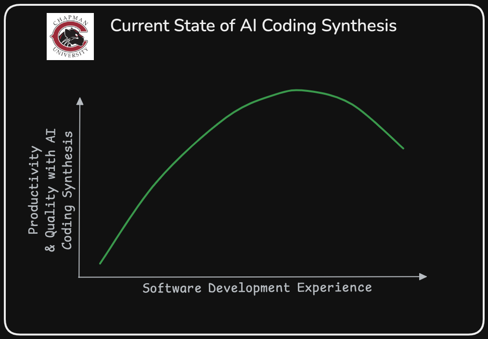
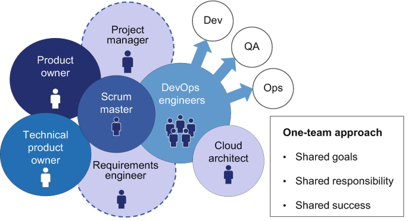

# Lecture 1

## Personal Introduction

## Motivation
    AI Transforming World
    Computer Science Education Rapidly Changing

## History
- Human Communication
- Formalized Mathematics and the Basis for Computer Science
- Compilers
- Tool Chains
- Formalized Methods

## Course Logistics
- Please join Discord (in Canvas)
- Will experiment with Anthropic Claude and OpenAI Chat-GPT 4o use of Aider
- Notes and assignments on GitHub
- GitHub centric problems

## Grading
- See Canvas Syllabus

## Other Details:
- Git Experience?
- IDE: VS Code or Vim preferred
- Discord for Communication
- LLMs
- Software Tool Chains
- What’s Recently Changed with AI
- Economics of Software Systems 

  

- Shift Left Paradigm 

  

## Homework
-  `git clone git@github.com:jeffrey-l-turner/CPSC_298.git` # learn how to use ssh!
- [see https://docs.github.com/en/authentication/connecting-to-github-with-ssh](https://docs.github.com/en/authentication/connecting-to-github-with-ssh)
- hook into Discord (instructions provided via on Canvas & Discord)

## References:
[ECON 295: The AI Awakening: Implications for the Economy and Society](https://explorecourses.stanford.edu/search?q=ECON295)
[Claude 3.5 Sonnet](https://www.anthropic.com/news/claude-3-5-sonnet)
[Software Engineering Market](https://youtu.be/ZcpZjrwhg_Q?si=IcdZhOE9rxKiG8f8)
["The End of Sofware Engineers"](https://youtu.be/ObDrrPx2P24?si=SWANGoFwNEoNIrc4)
[What is Old is New Again](https://youtu.be/VpPPHDxR9aM?si=_hr0ZEM1AitzQGJb)
