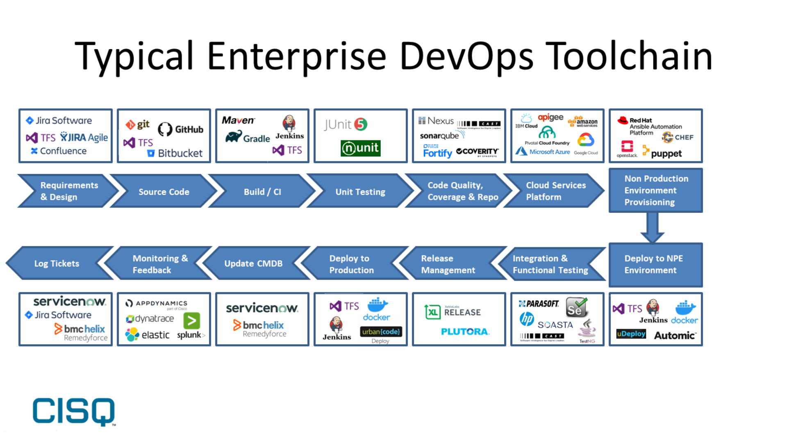

# Lecture 2

## Personal Introduction

## Housekeeping
    Accepting additional students
    May Change Rooms (note Canvas/Discord)
    Week in World of AI
    Homework?

## Legacy Software Tool Chains
- Git
- Languages & Frameworks
- Development Environments
- Debugging
- Testing

## Next Generation Software Tool Chains
- AI Git (Revision Control)
- Recommended by AI Languages & Frameworks
- Development Environments, Debugging, Tests
- Fast Iteration
- See video: Cursor, V0, Replit...

## Graphics:
- Legacy Software Tool Chains

  

## Quiz
- Concepts from past two lectures 

## References:
- [Coding an App in 1.5 hours](https://youtu.be/kDcM_xwmP3Q)
- [$3M a Year on $400 a Month](https://youtu.be/fvz2CxyGcyQ?si=pVjXAMrLfHXLVCoz)
