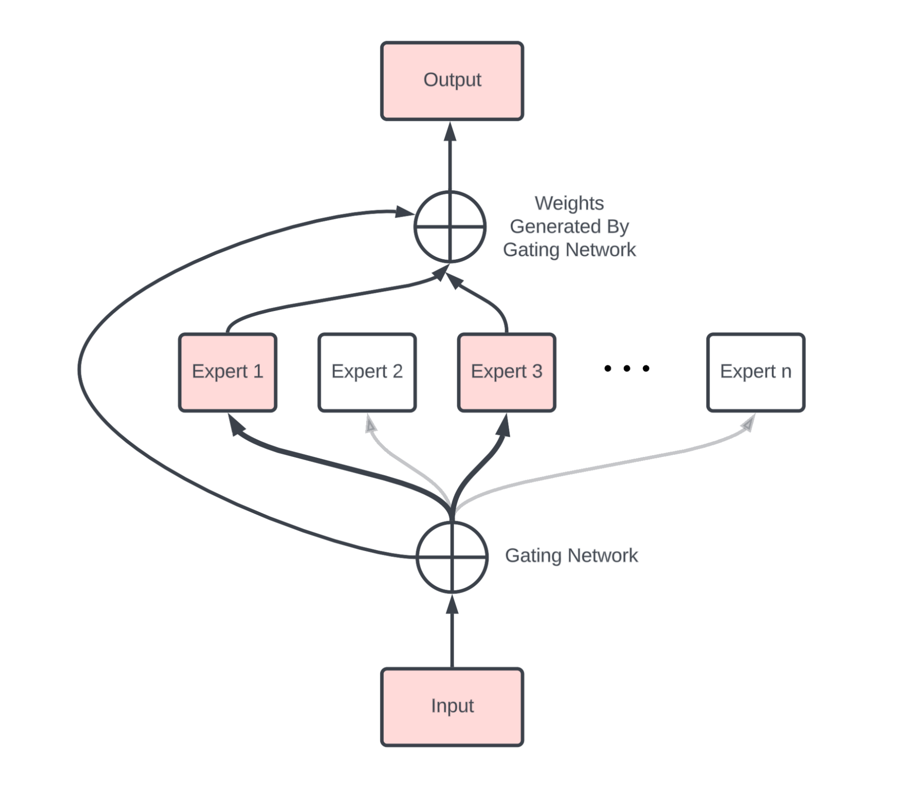
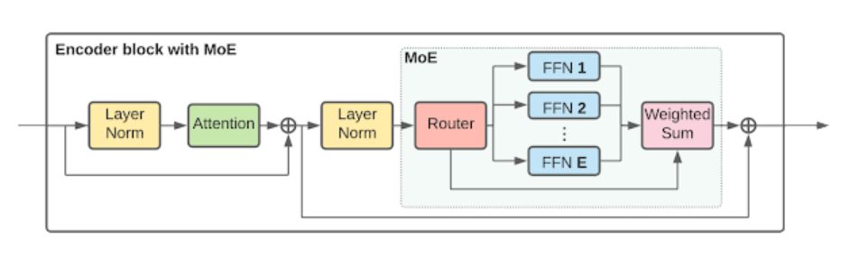

# Lecture 4

## Housekeeping
- Week in World of AI
    * Open AI Strawberry (o1)
    * [Google Notebook LM](https://notebooklm.google/)
    * [Updated Coding Benchmarks: Open AI, Anthropic, Google](https://www.youtube.com/watch?v=cESc7v1G1uA)
- Homework and Quizzes Assesment
- Cloud Recordings now with AI
- Reminder: Make sure you DM BOTH mobile & desktop Discord Accounts (add me as friend to do so)
- Tools for Next Lecture: LLM & Aider (see: Resources)

## Review how to use Github
- Git
    * SSH Keys
    * local Forks
    * Creating branches (prefer `git checkout -b <branch>`)
    * Setting up Pull Requests
- Setting Upstream and origin:
    * `git remote add upstream git@github.com:jeffrey-l-turner/CPSC_298.git`
    * `git remote add origin <your ssh repo address git@github.com:ghuser/CPSC_298.git` # if you're upstream was not set properly do `git rm origin` before this
    * `git pull master upstream`
    * `git push # to push changes to your fork`
- Survey of Development Environments (Aider, Cursor, V0...)

## Coding Assistance Tools; Reproducibility & Canonical Use
- What is Open Source
    * Licenses
    * LLMs: Weights, Model, & Data
- Higher Level Abstraction vs. Close to "metal" command line use
- Tooling: Aider vs. Github Copilot vs. Cursor vs. V0 + (Tabnine, JetBrains...)
- Determinism and Higher Level Abstractions

## Current AI & LLM Technology for Coding Synthesis
- Benchmarking
- Self Taught Reasoners (STaR)
- Chain/Tree of Thought Reasoning
- Feed Forward Networks & Autoregression with Loss Minimization
- Tokenization
- Next Token Prediction
- Transformers & Attention
- Context Windows
- Retrieval Augmented Generation (RAG)
- Mixture of Experts (MoE) and non-Composition
- Agents
- Need for Composition

## Artificial Neural Networks:
- Legacy Software Tool Chains

  

  

  

## Quiz
- Concepts from first four lectures 

## Previous Homework
- Everyone should have SSH keys setup along with forks
- Everyone should have placed notes on learning experience and screenshot of app in the `.md` file
- Everyone should have made a Pull Request to only your OWN repo fork - not class one.
- Everyone should have Discord Webhook

## References:
- [Chat GPT o1 Changes Everything](https://youtu.be/GUVrOa4V8iE?si=nuJ7nOqWuSNwlZDH)
- [Google's LM Notebook](https://youtu.be/b7GJ45oKQww?si=FCK2LSEEEEXOKNkK)
- [Open AI o2](https://youtu.be/K_3ww-kICiM?si=OgEtXyrEjNzhmy9n)
- [Re-review Coding an App in 1.5 hours](https://youtu.be/kDcM_xwmP3Q)
- [Cursor great but Aider is OG](https://youtu.be/ag-KxYS8Vuw?si=EVnlS-fwelkbx3JG)
- [Partially share this Philosophy](https://youtu.be/u3wPImWBz7c?si=GzUICDwL7lmCVXVj)
- [Correct(ness) by Construction (CbC)](https://youtu.be/rHY7nboIyBg?si=A_lapKTLNOksZgDE)
- [GPT 01 Looks like it is using STaR](https://youtu.be/KKF7kL0pGc4?si=h-kwL4xLqFRNFxLZ)
- Channels I Follow for this Class: [Wes Roth](https://www.youtube.com/@WesRoth), [Matthew Berman](https://www.youtube.com/@matthew_berman), [David Shapiro](https://www.youtube.com/@DaveShap/videos), [Indy Dev Dan](https://www.youtube.com/@indydevdan), [Greg Isenberg](https://www.youtube.com/@GregIsenberg), [3 Blue 1 Brown](https://www.youtube.com/@3blue1brown), [AI Explained](https://www.youtube.com/@3blue1brown)
- Tools: [Aider](https://aider.chat/) & [LLM](https://github.com/simonw/llm)
