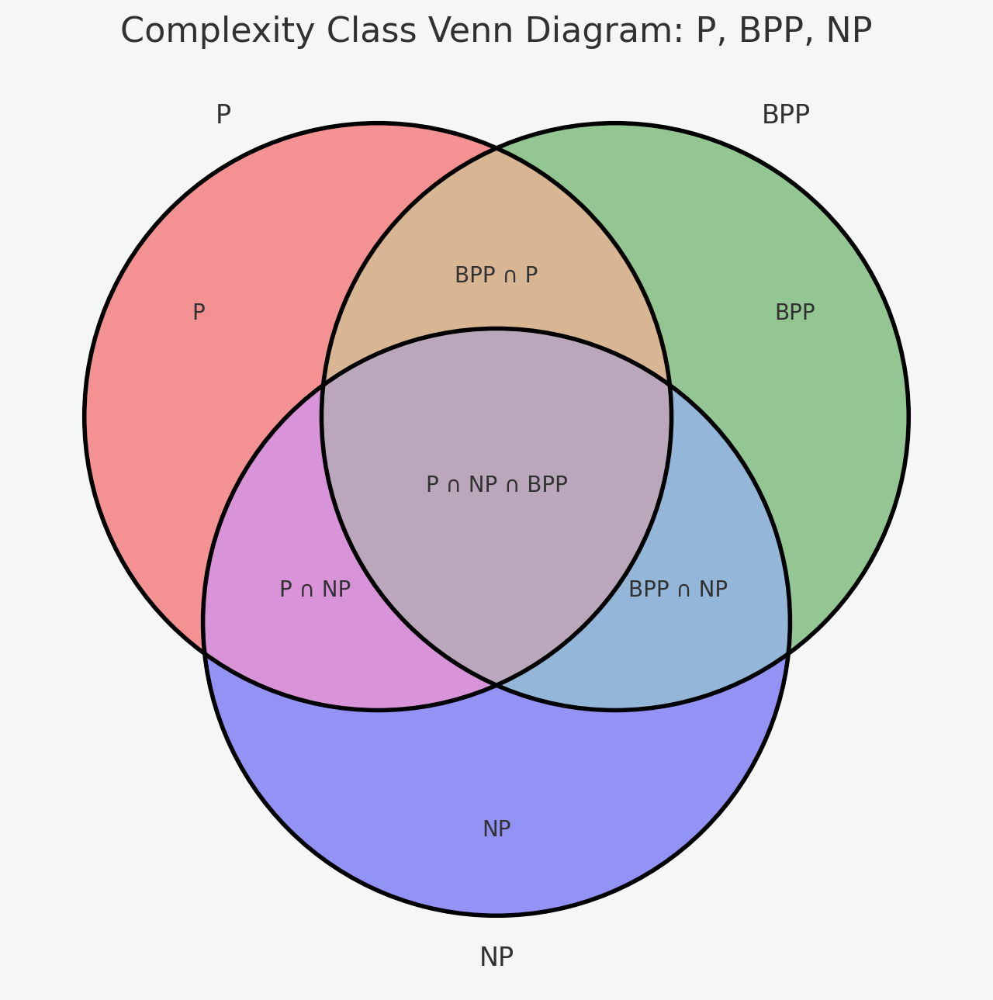
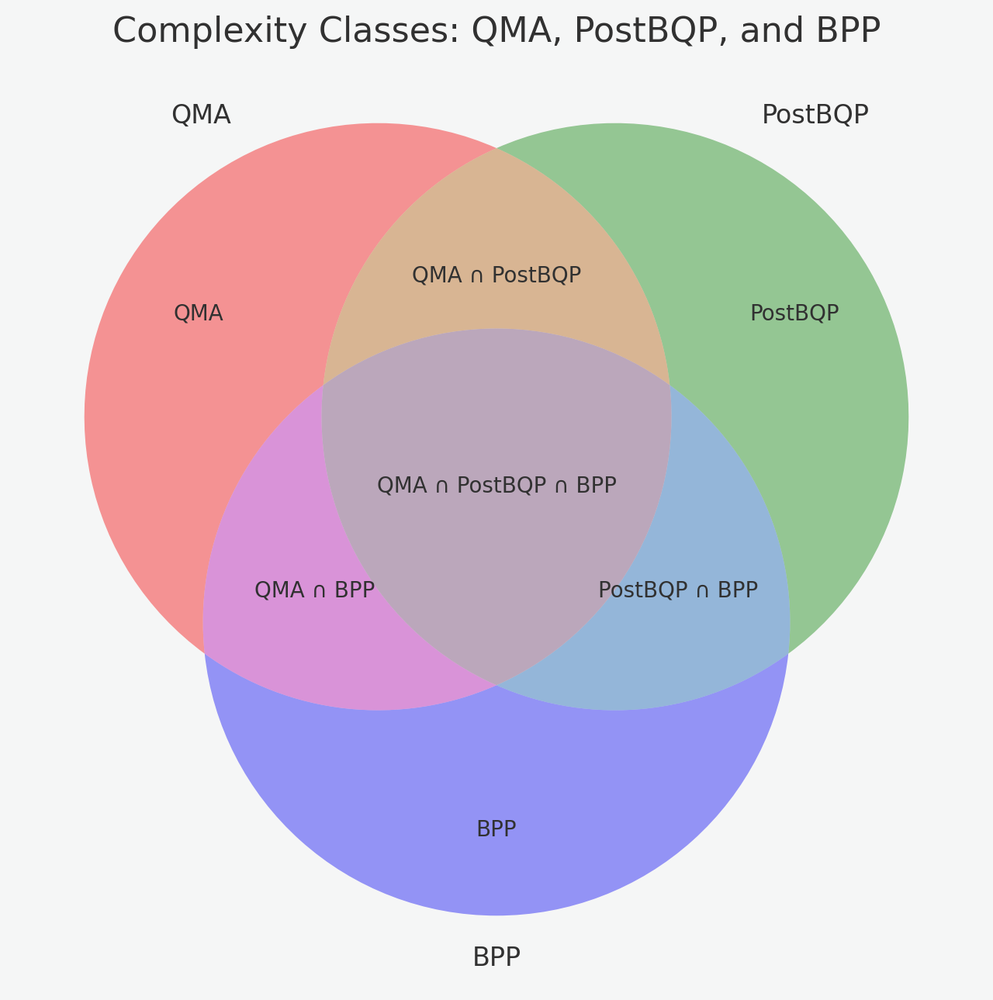

# Lecture 6

## Housekeeping
- Week in World of AI
    * [Newsome Vetos AI Bill](https://youtu.be/nEuWStd9Dxg?si=d6P1C6uPRwz8k2Xh)
    * [Pythagora: Human in the Loop Agentic Coder](https://youtu.be/spsG4G2sbrw?si=ncn2f7JneofJBzE1)
    * [New Llama Models & SLMs](https://youtu.be/VC6QCEXERpU?si=eqbZbClU2hfLEtZw)
    * [Sam Altman Interview: Catalysts of Change](https://youtu.be/ydPVL0HGpJ4?si=yeV4o_MHZFxQ-JGS)
    * [Post AGI Economics, DAOs & Decentralized Tech](https://youtu.be/9wbFXuF3xQ4?si=svJiO6Z1qBby2NV3)
    * [o1 Coding](https://youtu.be/-qPeR9GnEzo?si=fj_XquDElJlj11oN)
    * [AI Agents, Claude Engineering, and Startups](https://youtu.be/z4QsBsO3SS0?si=WvxBTLJwv0R3vT_r)
- Homework and Quizzes Assesment; Docking 10% minimum at end of day for current assignment.
- Canvas Updated once I review your PR (make sure I'm contributor/reviewer)

## Where Everyone Should Be Revisited:
- Discord Notifications with Webhook (DM me if you need the hook; Look in Discord help channel for Webhooks)
- Upstream forked and Setup on Personal Github accounts; Know Git/hub:
    * `ssh-keygen` & `ssh-add {-l}`
    * `git set upstream <branch>`
    * `git pull upstream master`
    * `git merge`
    * `git push {origin}`
    * `git checkout {-b} <branch>`
    * `ssh -vT git@github.com # check ssh key setup`
    * understand `.gitignore` and `.*` hidden files in project
- Pull Requests on Github, forks, and origin/upstreams synchronized.
- Basics of AI coding with V0 and setting up code on local repo
- Knowledge of TypeScript ecosystem with `npx`, `npm`, and NodeJS (ask AI if uncertain)
- AI Tooling: V0, Replit, Chat.dev, Copilot, Cursor, & Concepts:
    * Large Language Models (LLMs)
    * Feed forward networks (& ANNs)
    * Context Windows
    * Retrieval Augmented Generation (RAG)
    * Chain & Tree of Thought (CoT/ToT)
    * Self Taught Reasoning (STaR)
    * Tokenization and Transformer Architectures as well as Next Token Prediction
    * Mixture of Experts (MoE)
    * Agentic Approaches
    * Benchmarking, Weigths/Biases (Parameters) & Open Source Relevance (open weights, data, and models)
- API Keys setup & sample `.aider.conf.yml` in proper subdirectory
- Have me (jeffrey-l-turner) as reviewer/collaborator on Pull Requests (note Canvas will be graded once assignment complete)

## Artificial Neural Networks, Deep Learning, & Complexity:
- A model for AI & Computer Science

  

  

### Partial Definitions
- P: Problems solvable in polynomial time by a deterministic Turing machine.
- BPP: Problems solvable in polynomial time with a probabilistic Turing machine (bounded error).
- NP: Problems for which a proposed solution can be verified in polynomial time.
- The intersections represent potential overlaps between these classes:
- BPP: Problems that are both efficiently solvable deterministically and probabilistically.
- NP: Probabilistic problems for which solutions can be verified efficiently.
- QMA (Quantum Merlin-Arthur): A quantum analogue of the classical class 
- MA where a quantum verifier checks a quantum proof.
- PostBQP (Post-selected BQP): The class of problems solvable by a quantum computer with post-selection (an unphysical ability to conditionally halt computations based on outcomes).\
- BPP (Bounded-error Probabilistic Polynomial time): Classical probabilistic algorithms that solve problems with a bounded error probability.\

## Mid-Term
- Currently free / See above to get Groq key; [Open AI Compatibility](https://groq.com/groqcloud/)
- Fifth Week Assignment (#3)
    * `git pull upstream master; git push # on your forked master branch`
    * Make jeffrey-l-turner a collaborator on your fork & wait for acceptance; Place jeffrey-l-turner as reviewer on pull request
    * Copy and modify `assignments/sample.aider.conf.yml` to existing `assignments/`directory; Place Groq API key and model in this file so that Aider works properly
    * use Aider and/or LLM with your assignment to enhance code with UI; Make sure all code is committed from V0 in `assignments/` directory
    * Now using [`uv`](https://github.com/astral-sh/uv) to install aider and other Python tooling ([Windows:Chocalatey](https://chocolatey.org/install); Mac: [brew](https://brew.sh/) ; Linux: use `curl`)
- Make sure to enhance .md file with your screenshot and any notes
- Sign up for OpenRouter; Install aider with uv (`uv venv; uv pip install aider-chat`); Install [`llm`](https://github.com/simonw/llm) (e.g. `uv pip install llm` or `brew install llm`)
- Again, make sure jeffrey-l-turner is set to reviewer and changes have been committed into PR

## References:
- [Evidence of Strawberry (o1) being STaR]()
- [Using "close to the metal" AI coding synthesis (Aider + Cursor + Bun)](https://youtu.be/QlUt06XLbJE?si=NnwOeyl4BVPo8JRW)
- [Contextual RAG](https://youtu.be/42Da0O9zkhc?si=CyhxuoI44UwpNFoA)
- [Open AI Hates Transparency](https://youtu.be/gC9VW23fk9g?si=nXIe97yhVWD6uc7z)
- [The Intelligence Age](https://youtu.be/evDI1a6E8JY?si=pvjuI5rJmnRfJUBj)
- [ClaudDev](https://youtu.be/Xp8M9kmnV34?si=oW3iHIoibwZ9Hq-S)
- [Nuclear Power and new Microsoft AI Models](https://www.youtube.com/watch?v=T301T6H9l34)

## Resources:
- Channels I Follow for this Class: [Wes Roth](https://www.youtube.com/@WesRoth), [Matthew Berman](https://www.youtube.com/@matthew_berman), [David Shapiro](https://www.youtube.com/@DaveShap/videos), [Indy Dev Dan](https://www.youtube.com/@indydevdan), [Greg Isenberg](https://www.youtube.com/@GregIsenberg), [3 Blue 1 Brown](https://www.youtube.com/@3blue1brown), [AI Explained](https://www.youtube.com/@3blue1brown)
- Tools: [Aider](https://aider.chat/), [LLM](https://github.com/simonw/llm), & [uv](https://github.com/astral-sh/uv)
