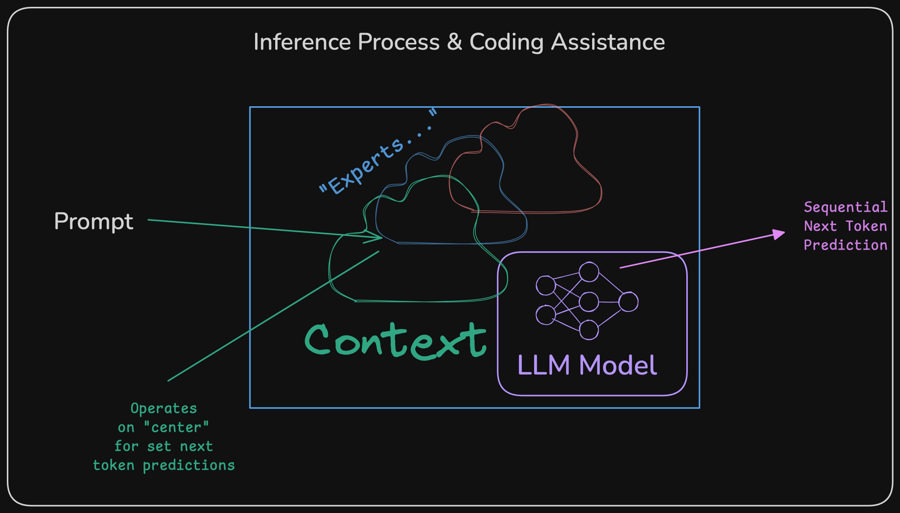

# Lecture 7

## Housekeeping
- Week in World of AI
    * [LLMs do not Reason & need for Symbolic AI](https://youtu.be/tTG_a0KPJAc?si=rEOKLYG1V3eB5VMW)
    * [David Ondrej on Agentic Frameworks](https://youtu.be/CK0oj9Ktfec?si=yvbwWcwJbyCfFTyI)
    * [Disappointment with Liquid Models](https://youtu.be/QzNI1HRIpYo?si=tv9cXBDMRQq0xiw9)
    * [Sabine Hossenfelder on AI Coding Assistance](https://youtu.be/3A-gqHJ1ENI?si=PGcN74PjJj6isBUh)
    * [o1 and Programming](https://youtu.be/j0yKLumIbaM?si=xXcayeeO4GLlF8tE)
    * [AI Assistance Market Segmentation](https://www.youtube.com/watch?v=8fEdaXwdDl8)
- Delayed grading on current assignment this week; You have until Tues. next week now; Will be looking at Github commits as source of truth
- Check Canvas for grading; DM me if you think it is not up to date
- This weeks quiz will be 20 minutes with 20 questions.
- Remember to `git pull upstream master && git push`
- Did not assign you an Open AI key if CSV is not updated and do not see PRs; I review the [#continuous integration channel on Discord](https://discord.com/channels/1204850325748457543/1204856923149697045)

## Where Everyone Should Be Revisited:
- Discord Notifications with Webhook (DM me if you need the hook; Look in Discord help channel for Webhooks)
- Upstream forked and Setup on Personal Github accounts; Know Git/hub:
    * `ssh-keygen` & `ssh-add {-l}`
    * `git set upstream <branch>`
    * `git pull upstream master`
    * `git merge`
    * `git push {origin}`
    * `git checkout {-b} <branch>`
    * `ssh -vT git@github.com # check ssh key setup`
    * understand `.gitignore` and `.*` hidden files in project
    * understand `git log` and how to reset out sync repos with the `upstream`
    * if on Mac: `ssh-add --apple-use-keychain  ... && ssh-add --apple-load-keychain` otherwise:
    * `ssh-add -K ~/.ssh/.ssh`
- Pull Requests on Github, forks, and origin/upstreams synchronized.
- Basics of AI coding with V0 and setting up code on local repo; Understand how to use Aider and LLM
- Knowledge of TypeScript ecosystem with `npx`, `npm`, and NodeJS (ask AI if uncertain)
- AI Tooling: V0, Replit, Chat.dev, Copilot, Cursor, & Concepts:
    * Large Language Models (LLMs)
    * Feed forward networks (& ANNs)
    * Context Windows
    * Retrieval Augmented Generation (RAG)
    * Chain & Tree of Thought (CoT/ToT)
    * Self Taught Reasoning (STaR)
    * Tokenization and Transformer Architectures as well as Next Token Prediction
    * Mixture of Experts (MoE)
    * Agentic Approaches
    * Benchmarking, Weigths/Biases (Parameters) & Open Source Relevance (open weights, data, and models)
- API Keys setup & sample `.aider.conf.yml` in proper subdirectory
- Have me (jeffrey-l-turner) as reviewer/collaborator on Pull Requests (note Canvas will be graded once assignment complete)
- Make Sure you're information is accurate on CSV posted in Discord
- Signup for [Pythathagora](https://www.pythagora.ai) - no luck getting access so far; Recommendation: use Cursor with Pythagora
- Understand basics of complexity theory and non-deterministic algos
- Up to date on CSV file. Will place whether Open AI key assigned

## Visualizing LLMs for Coding Assistance

  

## Python Coding Exercise
- Techniques
    * Triple quotes - """
    * LLMs as really good pattern matchers
    * Importance of repetion and context
    * Reinforcement prompting for defects and setting steps
    * Difference with o1 and 4o (STaR vs traditional MoE)
    * Using AI to plan out your code
    * Using "Judgement" -- AI cannot assess versioning for example (e.g. Rust, DenoJS vs NodeJS, Python 2/3, ...)

## References:
- [UV](https://github.com/astral-sh/uv)

## Resources:
- Channels I Follow for this Class: [Wes Roth](https://www.youtube.com/@WesRoth), [Matthew Berman](https://www.youtube.com/@matthew_berman), [David Shapiro](https://www.youtube.com/@DaveShap/videos), [Indy Dev Dan](https://www.youtube.com/@indydevdan), [Greg Isenberg](https://www.youtube.com/@GregIsenberg), [3 Blue 1 Brown](https://www.youtube.com/@3blue1brown), [AI Explained](https://www.youtube.com/@3blue1brown)
- Tools: [Aider](https://aider.chat/), [LLM](https://github.com/simonw/llm), & [uv](https://github.com/astral-sh/uv) [Data Centric](https://youtube.com/@data-centric?si=SjrEhrokPgsDoeYF) [Internet of Bugs](https://youtube.com/@internetofbugs?si=hahhYKaGX59agFjH) [The AI Grid](https://youtube.com/@theaigrid?si=ZhJcF-WMTwlFZwuP)
- [Open AI Key Management](https://platform.openai.com/)
